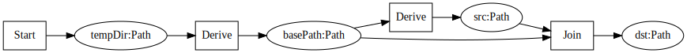

# Why you might use this library.

If you have to test some IO related problems you may find yourself in a situation where you have to create some
temporary files, and if you don't want to leave the garbage behind, to delete everything after the test is done.

As an example we are trying to create a directory, write some file to it, copy the content to a new file.
And after that we delete everything we created:

```java
Path baseDir = mkDir(tempDir, "sub");
assertThat(baseDir).exists();

try {
  Path source = writeFile(baseDir, "src", "source");
  assertThat(source).exists().content(StandardCharsets.UTF_8).isEqualTo("source");
  try {

    Path destination = copy(source, baseDir, "dst");
    assertThat(destination).exists().content(StandardCharsets.UTF_8).isEqualTo("source");

    // POINT OF RETURN

    delete(destination);
    assertThat(baseDir.resolve("dst")).doesNotExist();
  } finally {
    delete(source);
    assertThat(baseDir.resolve("src")).doesNotExist();
  }
} finally {
  delete(baseDir);
  assertThat(tempDir.resolve("sub")).doesNotExist();
}
```

(the asserts are there to express some expectations:)

.. since java 7 you can wrap some of this into an `AutoClosable` so that you can use the try-with-resources pattern.
We can create a very special wrapper:

```java
class Wrapper<T> implements AutoCloseable {
  final T value;
  private final Consumer<T> onClose;

  Wrapper(T value, Consumer<T> onClose) {
    this.value = value;
    this.onClose = onClose;
  }

  @Override
  public void close() {
    onClose.accept(value);
  }
}
```

.. and rewrite everything using try-with-resources, so that after the block is executed, the close method is called:

```java
try (Wrapper<Path> baseDir = new Wrapper<>(mkDir(tempDir, "sub"), this::delete)) {
  assertThat(baseDir.value).exists();
  try (Wrapper<Path> source = new Wrapper<>(writeFile(baseDir.value, "src", "source"), this::delete)) {
    assertThat(source.value).exists().content(StandardCharsets.UTF_8).isEqualTo("source");
    try (Wrapper<Path> destination = new Wrapper<>(copy(source.value,baseDir.value,"dst"), this::delete)) {
      assertThat(destination.value).exists().content(StandardCharsets.UTF_8).isEqualTo("source");

      // POINT OF RETURN
      
    }
    assertThat(baseDir.value.resolve("dst")).doesNotExist();
  }
  assertThat(baseDir.value.resolve("src")).doesNotExist();
}
assertThat(tempDir.resolve("sub")).doesNotExist();
```

As this example is not very complicated, even this looks a little over-engineered.
But life is more complicated than that. So let's have a look how we can solve this in another way.

First we need some unique identifier. It's like a variable name with some type information:

```java
StateID<Path> tempDir = StateID.of("tempDir", Path.class);
StateID<Path> baseDir = StateID.of("basePath", Path.class);
StateID<Path> source = StateID.of("src", Path.class);
StateID<Path> destination = StateID.of("dst", Path.class);
```

Next we describe how the values are created. As we already have the value for 'tempDir', we can just use this value
and map it to our "variable name". If we need some other values we declare them as given. As we want to remove
everything after it's usage, we can provide a callback with this value:

```java
Transition<Path> toTempDir = Start.to(tempDir).initializedWith(tempDirValue);

Transition<Path> toBaseDir = Derive.given(tempDir)
  .state(baseDir)
  .with(t -> State.of(mkDir(t, "sub"), this::delete));

Transition<Path> writeSrc = Derive.given(baseDir)
  .state(source)
  .with(b -> State.of(writeFile(b,"src","source"), this::delete));

Transition<Path> copySrcToDest = Join.given(source)
  .and(baseDir)
  .state(destination)
  .with((s,b) -> State.of(copy(s, b,"dst"), this::delete));
```

As we have all descriptions, we can work with them. The idea behind this all is as following. As each description
contains the information for what to do, what is needed and how we name the result, we can create a graph from
this information. In this way we know where to start and what is need is we want to get the next result. If something
is missing, or we have some kind of loop, it will fail. Because we don't want to deal with this graph by ourselves,
we use 'Transitions' as a wrapper around this kind of stuff:  

```java
Transitions transitions = Transitions.from(toTempDir, toBaseDir, writeSrc, copySrcToDest);
```

In this example we try to emulate the code from the previous sample (checks included):

```java
try (TransitionWalker.ReachedState<Path> withBaseDir = transitions.walker().initState(baseDir)) {
  assertThat(withBaseDir.current()).exists();
  try (TransitionWalker.ReachedState<Path> withSource = withBaseDir.initState(source)) {
    assertThat(withSource.current()).exists().content(StandardCharsets.UTF_8).isEqualTo("source");
    try (TransitionWalker.ReachedState<Path> withDestination = withSource.initState(destination)) {
      assertThat(withDestination.current()).exists().content(StandardCharsets.UTF_8).isEqualTo("source");

      // POINT OF RETURN

    }
    assertThat(withBaseDir.current().resolve("dst")).doesNotExist();
  }
  assertThat(withBaseDir.current().resolve("src")).doesNotExist();
}
assertThat(tempDirValue.resolve("sub")).doesNotExist();
```

But we don't have to do it this way. We can, but we must not initialize every state. But if we are only interested
in some or one part of it, everything else is working as expected. While this is running inside the same test method
we can reuse the transition instance and just run this again. This time we are asking for only one state:

```java
try (TransitionWalker.ReachedState<Path> withDestination = transitions.walker().initState(destination)) {
  assertThat(withDestination.current()).exists().content(StandardCharsets.UTF_8).isEqualTo("source");

  assertThat(tempDirValue.resolve("sub")).exists();
}
assertThat(tempDirValue.resolve("sub")).doesNotExist();
```

As we can build a graph we can also render this graph. Here we can render it as [Dot File](https://graphviz.org/doc/info/lang.html):                                                              

```java
String dotFile = Transitions.edgeGraphAsDot("copy-file", transitions.asGraph());
```

This is the [Dot-File](https://graphviz.org/doc/info/lang.html) for this example:

```dot
digraph "copy-file" {
	rankdir=LR;

	"de.flapdoodle.reverse.transitions.ImmutableDerive:0"[ shape="rectangle", label="Derive" ];
	"de.flapdoodle.reverse.transitions.ImmutableDerive:1"[ shape="rectangle", label="Derive" ];
	"de.flapdoodle.reverse.transitions.ImmutableJoin:0"[ shape="rectangle", label="Join" ];
	"de.flapdoodle.reverse.transitions.ImmutableStart:0"[ shape="rectangle", label="Start" ];
	"basePath:interface java.nio.file.Path"[ shape="ellipse", label="basePath:Path" ];
	"dst:interface java.nio.file.Path"[ shape="ellipse", label="dst:Path" ];
	"src:interface java.nio.file.Path"[ shape="ellipse", label="src:Path" ];
	"tempDir:interface java.nio.file.Path"[ shape="ellipse", label="tempDir:Path" ];

	"de.flapdoodle.reverse.transitions.ImmutableDerive:0" -> "basePath:interface java.nio.file.Path";
	"de.flapdoodle.reverse.transitions.ImmutableDerive:1" -> "src:interface java.nio.file.Path";
	"de.flapdoodle.reverse.transitions.ImmutableJoin:0" -> "dst:interface java.nio.file.Path";
	"de.flapdoodle.reverse.transitions.ImmutableStart:0" -> "tempDir:interface java.nio.file.Path";
	"basePath:interface java.nio.file.Path" -> "de.flapdoodle.reverse.transitions.ImmutableDerive:1";
	"basePath:interface java.nio.file.Path" -> "de.flapdoodle.reverse.transitions.ImmutableJoin:0";
	"src:interface java.nio.file.Path" -> "de.flapdoodle.reverse.transitions.ImmutableJoin:0";
	"tempDir:interface java.nio.file.Path" -> "de.flapdoodle.reverse.transitions.ImmutableDerive:0";
}

```



