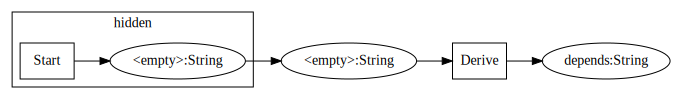

# A generic way to build an init-like System

When you start an applications then there are some preconditions that must be fulfilled. 
And if this application should stop, garbage has to be cleaned. This library provides building blocks to implement
such applications. 

## Building Blocks

An init-like system is more or less a graph of dependencies. So we define our system as transitions between vertices. 
A vertex is definied by a type and an optional name:

```java
StateID<String> id = StateID.of(String.class);
StateID<String> idWithLabel = StateID.of("foo", String.class);
```

Following transition types are possible:

```java
Start<String> start;
Derive<String, String> derive;
Join<String, String, String> merge;

start = Start.of(StateID.of(String.class), () -> State.of(""));
derive = Derive.of(StateID.of("a", String.class), StateID.of("b", String.class), State::of);
merge = Join.of(StateID.of("left", String.class), StateID.of("right", String.class),
  StateID.of("merged", String.class), (a, b) -> State.of(a + b));
```

which can be created with a fluent api:

```java
Start<String> start;
Derive<String, String> derive;
Join<String, String, String> merge;

start = Start.to(String.class).initializedWith("");
derive = Derive.given(StateID.of("a", String.class)).state(StateID.of("b", String.class)).deriveBy(it -> it);
merge = Join.given(StateID.of("left", String.class)).and(StateID.of("right", String.class))
  .state(StateID.of("merged", String.class)).deriveBy((a, b) -> a + b);
```

The result of a transition must be wrapped into a `State`, which provides an optional tearDown hook:

```java
State<String> state = State.builder("hello")
  .onTearDown(value -> System.out.println("tearDown " + value))
  .build();
```

The tearDown is called if needed.

### Define a System

In the beginning you need to create something out of noting.

```java
Transitions transitions = Transitions.from(
  Start.of(StateID.of(String.class), () -> State.of("hello"))
);

TransitionWalker walker = transitions.walker();

try (TransitionWalker.ReachedState<String> state = walker.initState(StateID.of(String.class))) {
  assertEquals("hello", state.current());
}

```

Our first dependency:

```java
Transitions transitions = Transitions.from(
  Start.of(StateID.of(String.class), () -> State.of("hello")),
  Derive.of(StateID.of(String.class), StateID.of("depends", String.class), s -> State.of(s + " world"))
);

TransitionWalker walker = transitions.walker();

try (TransitionWalker.ReachedState<String> state = walker.initState(StateID.of("depends", String.class))) {
  assertEquals("hello world", state.current());
}
```

Merging two dependencies:

```java
Transitions transitions = Transitions.from(
  Start.of(StateID.of("hello", String.class), () -> State.of("hello")),
  Start.of(StateID.of("again", String.class), () -> State.of("again")),
  Derive.of(StateID.of("hello", String.class), StateID.of("depends", String.class),
    s -> State.of("[" + s + "]")),

  Join.of(StateID.of("depends", String.class), StateID.of("again", String.class),
    StateID.of("merge", String.class),
    (a, b) -> State.of(a + " " + b))
);

TransitionWalker walker = transitions.walker();

try (TransitionWalker.ReachedState<String> state = walker.initState(StateID.of("merge", String.class))) {
  assertEquals("[hello] again", state.current());
}
```

Writing a custom transition:

```java
Transition<String> custom = new Transition<String>() {
  private StateID<String> first = StateID.of("depends", String.class);
  private StateID<String> second = StateID.of("again", String.class);

  @Override public StateID<String> destination() {
    return StateID.of("custom", String.class);
  }
  @Override public Set<StateID<?>> sources() {
    return StateID.setOf(first, second);
  }
  @Override public State<String> result(StateLookup lookup) {
    String firstValue = lookup.of(first);
    String secondValue = lookup.of(second);
    return State.of(firstValue + " " + secondValue);
  }
};

Transitions transitions = Transitions.from(
  Start.of(StateID.of("hello", String.class), () -> State.of("hello")),
  Start.of(StateID.of("again", String.class), () -> State.of("again")),
  Derive.of(StateID.of("hello", String.class), StateID.of("depends", String.class),
    s -> State.of("[" + s + "]")),

  custom
);

TransitionWalker walker = transitions.walker();

try (TransitionWalker.ReachedState<String> state = walker.initState(StateID.of("custom", String.class))) {
  assertEquals("[hello] again", state.current());
}
```

The ordering of each entry does not matter. We only have to define our transitions, how to get to the destination is automatically resolved.
No transition is called twice and it is possible to work on an partial initialized system.

```java
Transitions transitions = Transitions.from(
  Start.of(StateID.of(String.class), () -> State.of("hello", tearDownListener())),
  Derive.of(StateID.of(String.class), StateID.of("depends", String.class), s -> State.of(s + " world", tearDownListener()))
);

TransitionWalker walker = transitions.walker();

try (TransitionWalker.ReachedState<String> state = walker.initState(StateID.of(String.class))) {
  assertEquals("hello", state.current());
  try (TransitionWalker.ReachedState<String> subState = state.initState(StateID.of("depends", String.class))) {
    assertEquals("hello world", subState.current());
  }
}
```

One way to join different independent transitions without collisions is to use a initialized
transition as a state which will be teared down automatically.

```java
Transitions baseRoutes = Transitions.from(
  Start.of(StateID.of(String.class), () -> State.of("hello", tearDownListener()))
);

TransitionWalker baseInit = baseRoutes.walker();

Transitions transitions = Transitions.from(
  Start.of(StateID.of(String.class), () -> baseInit.initState(StateID.of(String.class)).asState()),
  Derive.of(StateID.of(String.class), StateID.of("depends", String.class),
    s -> State.of(s + " world", tearDownListener()))
);

TransitionWalker walker = transitions.walker();

try (TransitionWalker.ReachedState<String> state = walker.initState(StateID.of(String.class))) {
  assertEquals("hello", state.current());
  try (TransitionWalker.ReachedState<String> subState = state.initState(StateID.of("depends", String.class))) {
    assertEquals("hello world", subState.current());
  }
}
```

An other way is to wrap transitions and only expose incoming and outgoing connections.

```java
Transitions baseRoutes = Transitions.from(
  Start.of(StateID.of(String.class), () -> State.of("hello", tearDownListener()))
);

TransitionWalker baseInit = baseRoutes.walker();

Transitions transitions = Transitions.from(
  baseInit.asTransitionTo(TransitionMapping.builder("hidden", StateID.of(String.class))
    .build()),
  Derive.of(StateID.of(String.class), StateID.of("depends", String.class),
    s -> State.of(s + " world", tearDownListener()))
);

TransitionWalker walker = transitions.walker();

try (TransitionWalker.ReachedState<String> state = walker.initState(StateID.of(String.class))) {
  assertEquals("hello", state.current());
  try (TransitionWalker.ReachedState<String> subState = state.initState(StateID.of("depends", String.class))) {
    assertEquals("hello world", subState.current());
  }
}

```

... visible in this graph (dot file):

```
digraph "wrapped" {
  rankdir=LR;

  "<empty>:ClassTypeInfo{type=class java.lang.String}"[ shape="ellipse", label="<empty>:String" ];
  "de.flapdoodle.reverse.transitions.ImmutableDerive:0"[ shape="rectangle", label="Derive" ];
  "depends:ClassTypeInfo{type=class java.lang.String}"[ shape="ellipse", label="depends:String" ];
  subgraph cluster_1 {
    label = "hidden";
    "de.flapdoodle.reverse.ImmutableMappedWrapper:0__<empty>:ClassTypeInfo{type=class java.lang.String}"[ shape="ellipse", label="<empty>:String" ];
    "de.flapdoodle.reverse.ImmutableMappedWrapper:0__de.flapdoodle.reverse.transitions.ImmutableStart:0"[ shape="rectangle", label="Start" ];

    "de.flapdoodle.reverse.ImmutableMappedWrapper:0__de.flapdoodle.reverse.transitions.ImmutableStart:0" -> "de.flapdoodle.reverse.ImmutableMappedWrapper:0__<empty>:ClassTypeInfo{type=class java.lang.String}";
  }

  "<empty>:ClassTypeInfo{type=class java.lang.String}" -> "de.flapdoodle.reverse.transitions.ImmutableDerive:0";
  "de.flapdoodle.reverse.transitions.ImmutableDerive:0" -> "depends:ClassTypeInfo{type=class java.lang.String}";
  "de.flapdoodle.reverse.ImmutableMappedWrapper:0__<empty>:ClassTypeInfo{type=class java.lang.String}" -> "<empty>:ClassTypeInfo{type=class java.lang.String}";
}

```

